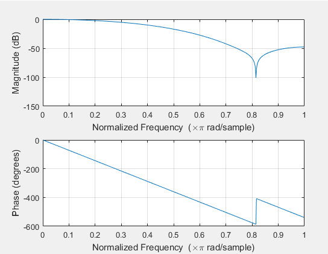
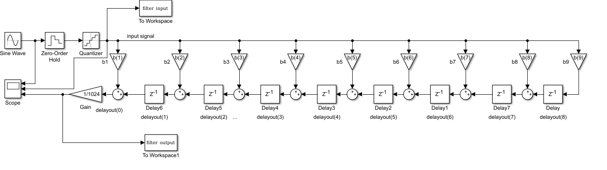
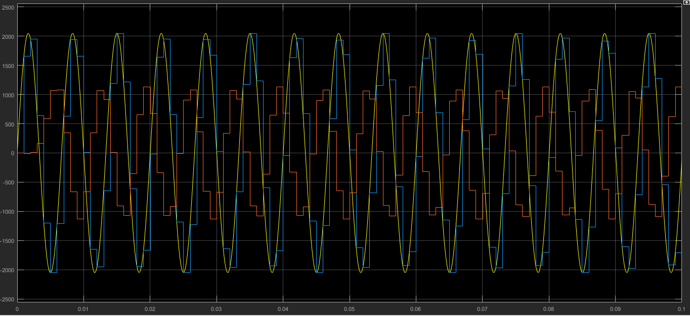
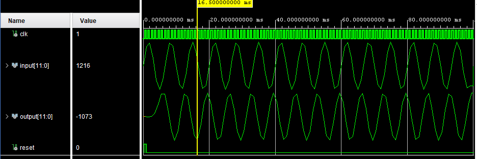

# 8th Order FIR Filter

## Description
This VHDL entity implements an 8th order FIR filter. The filter has a signed 12 bit in and output and works on 24 bit internally. The test bench for the filter uses a .csv file as input with test vectors generated by Simulink.

### Filter Design
The Filter is designed, using the fir1 filter design function of Matlab, to generate filte coefficients for a Hamming-based filter. The chose filter values to test the VHDL FIR code are a sample rate of 1kHz and a cut off frequency of 150 Hz in this example. The filter coefficients are then multiplied by 1024, as the filter implementation in VHDL works with 10 binary decimals. The following graph shows the bode diagram of the filter:
 

 The filter coefficients, found in the b vector are then implemented 

### Filter Simulation
After filter design, the filter is simulated in Simulink. For this, a model of a transposed FIR filter is used. The following graph shows the filter block diagram:
 

 As an input signal, a sine wave at the cut-off frequency of the filter is chosen. It is then sampled with a sample rate of 1kHz and quantized to 12 bit. 
 The following graph shows the filter simulation results. The yellow line is the input to the signal in continuous time domain, while blue signal is the discretized version thereof. The red signal is the output of the filter. The simulation is done at the cut off frequency of the filter, which means, that the output signal amplitude is half of the input signal amplitude.

  

### Filter Implementation and Behavioral Simulation
The filter is then implemented in VHDL. A Test bench is writte to conduct some basic test of the filter. The Simulink simulation writes simulated filter input and output values to a .csv file. This .csv file is then read in by the testbench for the filter to test it. Before applying the signals generated by the simulink simulation, the test bench resets the filter`s internal states. The following graph shows the VHDL behavioral simulation of the filter.

  

## Usage
### Matlab Simulation
To try the code out yourself, open the file FIR_Filter_Design.m in Matlab and execute it. Subsequently, open the Simulink simulation of the filter Filter_Simulation.slx and run it. As the Simulink simulation relies on the values generated by the Filter Design, the order of execution is relevant.

### VHDL implementation
Open the Test bench for the filter, FIR_Filter_tb.vhd, in a VHDL simulation environment (tested with AMD Vivado) and execute it. The test vectors are generated by the simulink simulation. So to change the input signal in the behavioral simulation of the flter, re-run the Simulink simulation with a different input signal and observe the TestData.csv file beeing re-generated. Then re-run the VHDL test bench to read in the new signal and apply it to the filter.

