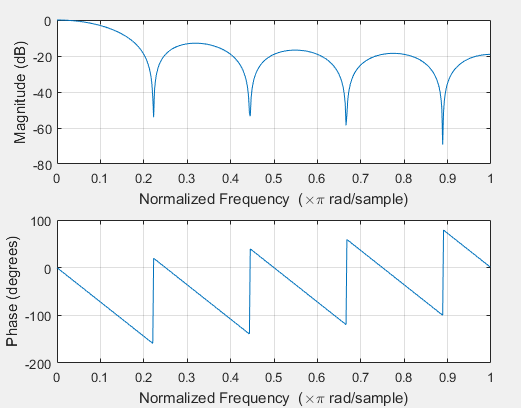
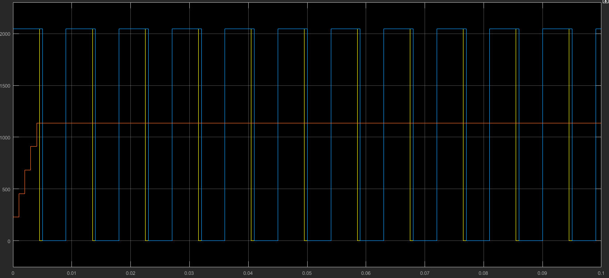
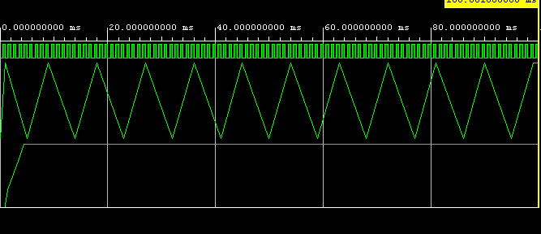
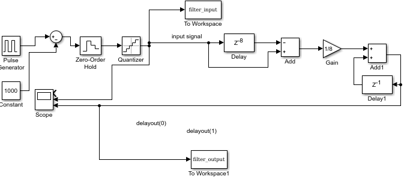

# Moving Average Filter
There are several ways to implement a moving average filter. This folder contains multiple possible implementations of such a filter in VHDL.

## FIR-Filter structure
The FIR filter structure from the 8th Order FIR Filter folder can be re-used to implement a moving average filter. To do so, all filter coefficients are set to 1/9. The frequency response of this filter is shown below:

 

 The following graph shows the response of this filter to a 50% with a frequency at exactly the first pole of the filter:

 
 

 The VHDL behavioral simulation confirms the correct functionality of the VHDL implementation:

  

## Recursive Implementation
The Moving Average Filter can also be implemented recursively, as shown in the following block diagram:
  

